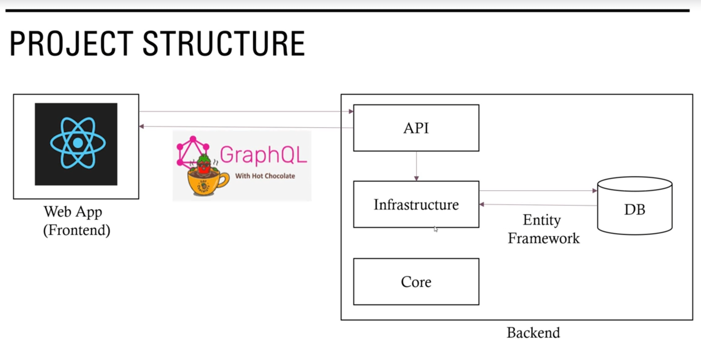

# OrderManagementGraphQL

A fullstack app to maintain and track customers and orders using the following technologies:

- .Net 8
- React
- GraphQL and HotChocolat
- EF
- Apollo CodeGen
- Docker
- Material UI
- Relational DB

[OrderManagementApp Project Reference](https://github.com/ivanthagura/OrderManagementApp)



## Backend

```powershell
dotnet new sln --name OrderManagementBackend --dry-run

dotnet new webapi -o API --dry-run
dotnet new classlib -o Infrastructure
dotnet new classlib -o Core

dotnet sln add API
dotnet sln add Infrastructure
dotnet sln add Core
```

## GraphQL

http://localhost:5263/graphql/

```json
query GetCustomers {
  customers {
    id
    firstName
    lastName
    contactNumber
    email
    address {
      addressLine1
      addressLine2
      city
      state
      country
    }
    orders {
      id
      customerId
      orderDate
      depositAmount
      description
      isDeleted
      isDelivery
      otherNotes
      status
      totalAmount
    }
  }
}

query GetCustomerById{
  customers(where: {id: {eq: 1}}){
    id
    firstName
    lastName
    contactNumber
    email
    address{
      addressLine1
      addressLine2
      city
      state
      country
    }
    orders{
      id
      customerId
      orderDate
      description
      totalAmount
      depositAmount
      isDelivery
      status
      otherNotes
    }
  }
}

query GetOrders {
  orders {
    id
    customerId
    orderDate
    description
    totalAmount
    depositAmount
    isDelivery
    status
    otherNotes
    customer {
      firstName
      lastName
      contactNumber
      email
    }
  }
}

query GetOrderById{
  orders(where: {id: {eq: 1}}){
    id
    customerId
    orderDate
    description
    totalAmount
    depositAmount
    isDelivery
    status
    otherNotes
    customer {
      firstName
      lastName
      contactNumber
      email
    }
  }
}
```

## GraphQL Voyager

Relations between db tables and GraphQL

http://localhost:5263/graphql-voyager

## Create Database Migrations

```powershell
dotnet ef migrations add InitialCreate -p backend/Infrastructure -s backend/API -o Migrations

dotnet ef migrations remove -p backend/Infrastructure -s backend/API

dotnet ef database update -s backend/API
```

## Crud Operations

```json


```
